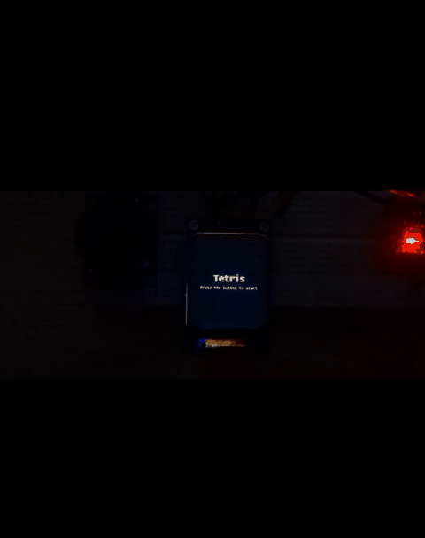
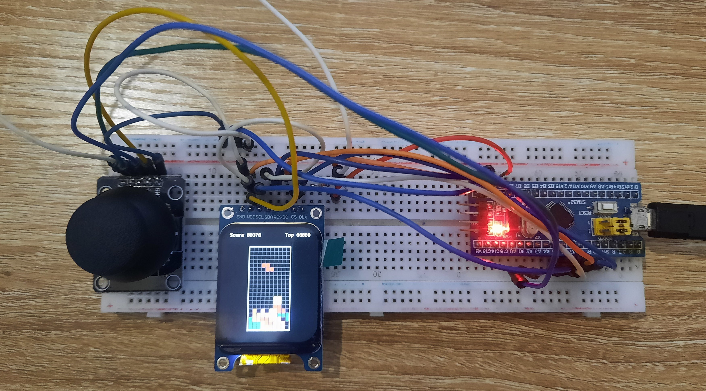
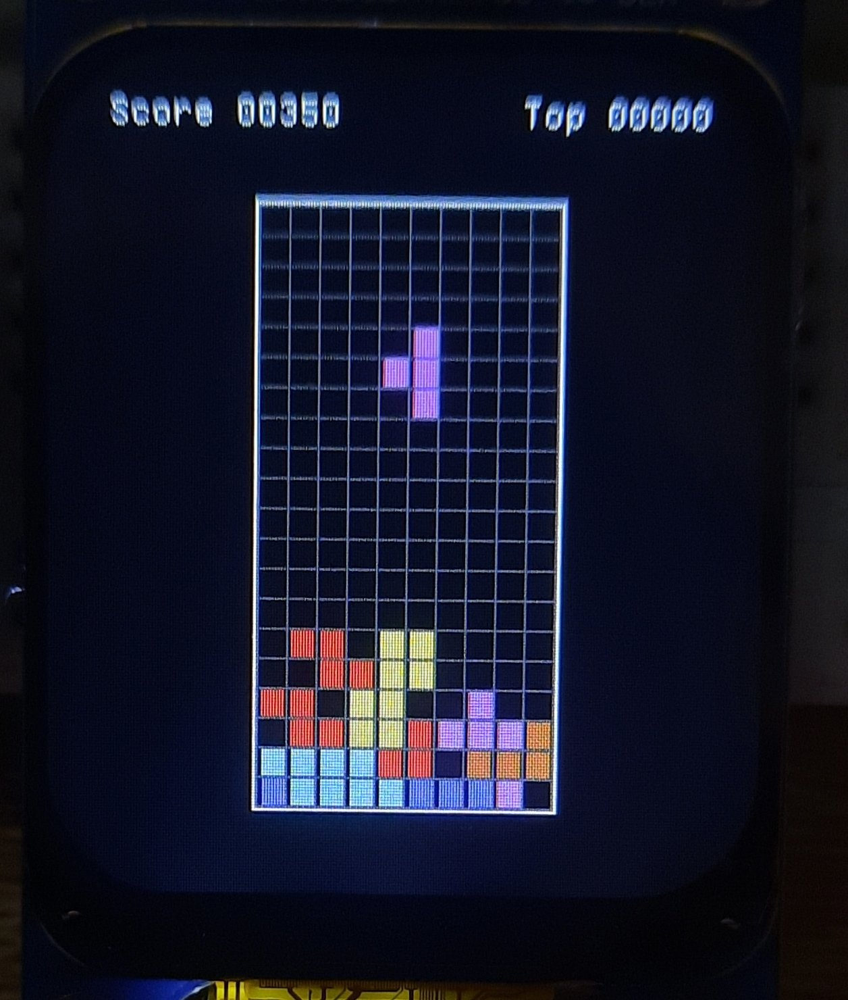

# Tetris

## Contents
- [Tetris](#tetris)
  - [Game Rules](#game-rules)
  - [Hardware](#hardware)
  - [Software](#software)
    - [Game Control](#game-control)
    - [Game Logic, Scoring, and Rendering](#game-logic-scoring-and-rendering)
    - [AAPCS](#aapcs)
  - [Demo & Media](#demo--media)
    - [Gameplay Preview](#gameplay-preview)
    - [Hardware & Display](#hardware--display)

    

---

## Tetris

Tetris is a classic tile-matching puzzle game where geometric shapes, called *tetrominoes*, fall from the top of the screen into a rectangular playfield. The player manipulates these tetrominoes by rotating and moving them horizontally to create complete horizontal rows. Once a row is completely filled, it is cleared, and the blocks above it move down.

This project is a **bare-metal embedded implementation of Tetris** on an STM32 microcontroller, combining **C and ARM assembly** to handle rendering, game logic, and low-level control with precise timing and performance.

---

## Game Rules

- Tetrominoes fall from the top of the screen one at a time.
- The player can:
  - Move tetrominoes left or right.
  - Rotate tetrominoes.
  - Accelerate the falling speed.
- When a tetromino can no longer move downward, it becomes locked in place.
- Each locked tetromino awards 10 points.
- If a horizontal row is completely filled:
  - The row is cleared.
  - All rows above move down.
  - Each cleared row awards 100 points.
- The game ends when new tetrominoes can no longer be placed at the top of the playfield.
- The objective is to survive as long as possible and maximize the score.

---

## Hardware

The hardware platform for this project consists of:

- **Microcontroller**
  - STM32F103C8T6 (ARM Cortex-M3)

- **Input Device**
  - Analog joystick with:
    - Two axes (X and Y)
    - One push button
  - The joystick axes are connected to **two channels of ADC1**
  - ADC conversions are **triggered by a timer**
  - The joystick push button is handled using an **external interrupt (EXTI)**

- **Display**
  - Full-color TFT display module
  - SPI interface
  - ST7789 display driver

---

## Software

The software is developed using a **bare-metal approach**:

- An **empty STM32 project** is created.
- **CMSIS** and **HAL** libraries are added manually.
- **STM32CubeMX is not used**.

### Game Control

- The game starts when the user **presses the joystick button**.
- During gameplay:
  - Pressing the joystick button **pauses or resumes** the game.
  - Joystick actions:
    - **Up**: rotate the tetromino.
    - **Left / Right**: move the tetromino horizontally.
    - **Down**: increase the falling speed by **5×**.

### Game Logic, Scoring, and Rendering

- Core game logic is implemented in **ARM assembly**, including:
  - Collision detection
  - Boundary checking
  - Filled-row detection and clearing
  - Movement validation (left, right, down)
  - **Score updates for row clearing and piece locking**
- Scoring rules:
  - **+10 points** for each tetromino locked in place
  - **+100 points** for each cleared row
- Rendering and display handling are implemented in **C**.
- A **Linear Feedback Shift Register (LFSR)** is used to generate pseudo-random tetrominoes.
  - The LFSR is written in **assembly**.
  - The seed is taken from a **timer value at the moment the start button is pressed**.

All interactions between C and assembly strictly follow the **AAPCS** standard.

### AAPCS

The **AAPCS (ARM Architecture Procedure Call Standard)** defines how functions communicate on ARM architectures. It specifies:

- Function argument passing:
  - The first four arguments are passed in registers **R0–R3**
  - If a function has more than four arguments, the remaining arguments are passed on the **stack**
- Return values:
  - Returned in **R0**
- Register preservation:
  - Registers **R4–R11** and **SP** must be preserved by the callee
- Function return mechanism:
  - The **Link Register (LR)** is used for returning from functions

By following AAPCS, seamless and reliable interaction between **C and ARM assembly** is ensured throughout the project.

---

## Demo & Media

### Gameplay Preview

  

▶ **[Watch full gameplay video](Media/Demo.mp4)**

---

### Hardware & Display

  
  

  <em>Left: Breadboard setup with STM32F103 and joystick &nbsp;|&nbsp; Right: Tetris running on TFT display</em>

